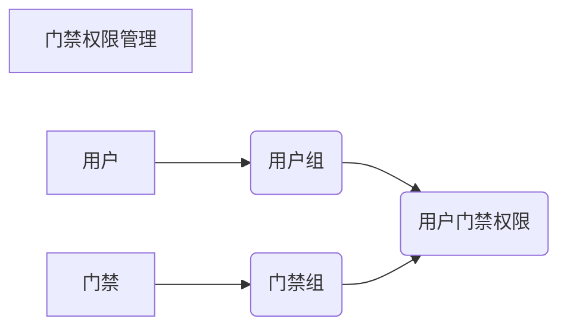
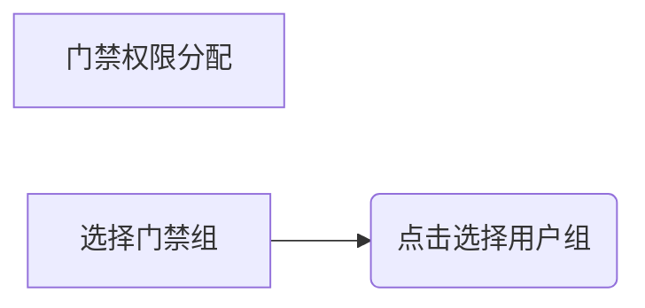

## 开发相关信息

mysql相关信息： url:db.cheercare.net port:3306 user:acs
password:Cheercare8#9
正式开发使用acs_dev库，测试调试若依相关功能请使用ry_uve_test库  
redis相关信息： url:db.cheercare.net port:6379 password:Cheercare5@3

前端运行命令： cd acs_ui  
npm install --registry=https://registry.npm.taobao.org  
npm run dev

## 门禁权限管理设计概要
**门禁组和用户组**
> 门禁组和用户组为1->n的关系，用户组和用户n<->n，门和门组n<->n

**给用户分配门禁权限**
> 采用在门禁组页面为主体选择用户组进行分配

## 门禁组-用户组数据增量逻辑

用户组->没有分配到门禁组->
用户组->已分配到门禁组

## 命令表
> 所有与控制器的操作全部由命令表中的命令对应的业务队列完成

### 表设计

*队列表(用户权限组、排版模板、日计划、假日组数据变动时触发存储)*
任务ID,控制器ID,命令,暂存数据(由longtext存储,以防数据被动态修改),创建时间,下发时间,耗时

*下发日志表(记录成功和失败记录,方便后续数据操作)*
任务ID,控制器ID,命令,数据(每条单独存储),创建时间,下发时间,状态(成功|失败)

|命令|说明|
|--|--|
|10|下发人员信息|
|11|修改人员信息|
|12|删除人员信息|
|20|新增排班模板|
|21|修改排班模板|
|22|删除排班模板|
|30|新增假日计划|
|31|修改假日计划|
|32|删除假日计划|
|41|新增假日组|
|42|修改假日组|
|43|删除假日组|

## 推送
> 使用websocket实现,不同的topic对应不同的消息类型
>

## TODO List
1、命令表 包含 控制器内的排班模板 假日计划 假日组的新增 修改 删除
控制器对应的人的权限的新增修改删除
2、在对应的命令相关的表做出修改的时候，生成命令记录加入命令表中
3、工作队列  一个队列数组，可配置数组大小，当前端发起命令时，读取命令表中对应的命令数据，根据命令数据中控制器的id取余后丢到对应的队列中，队列收到命令后，按照顺序取出命令并执行
4、推送 主要推送报警信息和处理结果，前端可按照topic就行订阅，后端把结果按照对应的topic推送到前端
5、权限组和用户组添加部门字段，做数据权限处理
6、卡添加有效期起止字段
7、添加权限组内控制器时，只能选择登录用户所属部门区域内的控制器
8、添加用户组修改为通过条件筛选结果后，结果放在穿梭框内再做添加处理，筛选结构应排除现有已选用户
9、添加用户组应能搜索到临时卡类别的卡片